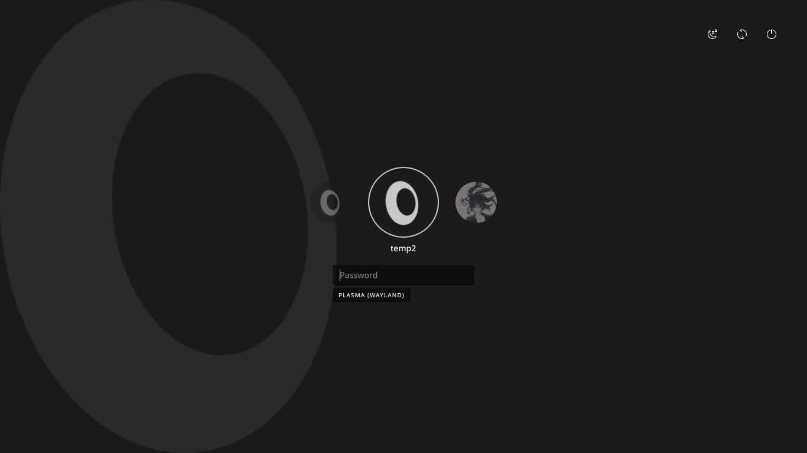

<div align="center">
  
  <h1>Nula SDDM Theme</h1>
  <p>A minimalist SDDM theme featuring a smooth user carousel and modern dark interface.</p>
</div>

<p align="center">
  <a href="#installation"></a>
  <a href="LICENSE"></a>
  <a href="https://github.com/l7p3x/Nula-SDDM/stargazers"></a>
</p>

---

## Overview

**Nula** is a modern, minimalist SDDM theme designed to stay out of your way while looking distinctive. Taking inspiration from clean design principles, it emphasizes clarity, smooth motion, and simplicity.

It features a sleek dark interface, a fluid user carousel, and subtle animations that make your login experience both beautiful and functional.

## Features

- **Smooth User Carousel**: Effortlessly switch between multiple user accounts.
- **Dark Minimalist Interface**: Easy on the eyes with a clean, modern aesthetic.
- **Session Selector**: Integrated and intuitive session switching.
- **Power Controls**: Quick access to shutdown, reboot, and suspend options.
- **Highly Customizable**: Tweak colors, avatars, and borders via `theme.conf`.

### Login Screen

<div align="center">
  
</div>

## Installation

### 1. Clone the Repository
```bash
git clone https://github.com/l7p3x/Nula-SDDM.git
cd Nula-SDDM
```

### 2. Install the Theme
Copy the theme files to your SDDM themes directory:
```bash
sudo cp -r . /usr/share/sddm/themes/nula
```

### 3. Configure SDDM
Open your SDDM configuration file (usually located at `/etc/sddm.conf` or `/etc/sddm.conf.d/kde_settings.conf`):
```bash
sudo nano /etc/sddm.conf
```

Find the `[Theme]` section and set `Current` to `nula`:
```ini
[Theme]
Current=nula
```
*(If the `[Theme]` section doesn't exist, simply add it to the end of the file.)*

### 4. Apply Changes
Restart SDDM or simply reboot your system:
```bash
sudo systemctl restart sddm
```
> **Warning:** Restarting SDDM will close your current graphical session. Make sure to save your work!

## Customization

Nula exposes basic configuration options through the `theme.conf` file. You can edit `/usr/share/sddm/themes/nula/theme.conf` to change:

- **Default Avatar**: Path to the default user avatar.
- **Avatar Size**: Adjust the dimensions of the user avatar.
- **Avatar Border Color**: Customize the color of the avatar's border.
- **Avatar Border Width**: Change the thickness of the avatar's border.

*Looking for advanced tweaks?* 
Features like animations, interface layout, carousel behavior, and element positioning require editing the theme's QML files directly (`Main.qml` and `components/`).

## Directory Structure

```text
Nula-SDDM/
├── assets/             # Images, icons, and fonts
├── components/         # Reusable QML components
├── Main.qml            # Main theme layout and logic
├── metadata.desktop    # Theme metadata
└── theme.conf          # Theme configuration file
```

## Dependencies

Since Nula uses `Qt5Compat.GraphicalEffects`, it requires **Qt6** versions of the SDDM dependencies. Ensure you have the following packages installed:

**Arch Linux:**
```bash
sudo pacman -S sddm qt6-quickcontrols2 qt5compat
```

**Ubuntu/Debian (Plasma 6):**
```bash
sudo apt install sddm qml6-module-qtquick-controls qml6-module-qt5compat-graphicaleffects
```

**Fedora:**
```bash
sudo dnf install sddm qt6-qtquickcontrols2 qt6-qt5compat
```

## Uninstallation

To remove the theme, simply delete the theme folder and revert your SDDM configuration:

```bash
sudo rm -rf /usr/share/sddm/themes/nula
```
Then, change the `Current` theme in `/etc/sddm.conf` back to your previous theme (e.g., `breeze` or `sugar-candy`).

## License

This project is licensed under the GPL v3 License - see the [LICENSE](LICENSE) file for details.

## Acknowledgements

Created with ❤️ by **l7p3x**.

### Credits

This project uses 3 icons from the **Yet Another Monochrome Icon Set** project:

- **Original Project**: https://bitbucket.org/dirn-typo/yet-another-monochrome-icon-set/src/main/
- **Original Author**: Dirn

Thank you to Dirn for the beautiful icon set!
